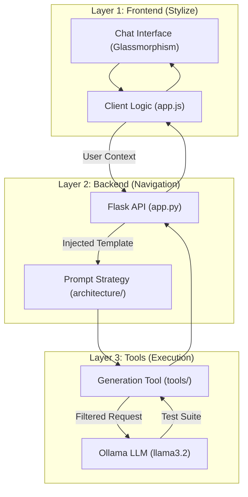

# AITester - Local LLM Testcase Generator

A premium, privacy-focused tool to generate comprehensive test suites (Unit & Integration) using local LLMs through Ollama. Built with the **B.L.A.S.T** protocol and **A.N.T 3-layer architecture**.

## 🏗 System Architecture



## ✨ Features
- **Deterministic Code Generation**: Uses low-temperature settings for reliable output.
- **Glassmorphic UI**: High-end dark mode aesthetics with real-time status indicators.
- **100% Local**: No data ever leaves your machine.
- **Protocol Adherent**: Built following strict SDET standards for reliability and maintainability.

## 🚀 Getting Started

### Prerequisites
1.  **Install Ollama**: [ollama.com](https://ollama.com)
2.  **Pull Model**:
    ```bash
    ollama pull llama3.2
    ```

### Installation
1.  **Clone the Repository**:
    ```bash
    git clone https://github.com/Ravikumar191179/AI-Tester-BluePrint-Projects.git
    cd Project1-LocalTestcaseGenerator
    ```
2.  **Install Dependencies**:
    ```bash
    pip install -r requirements.txt
    ```

### Running the App
```bash
python3 app.py
```
Visit `http://localhost:5001` in your browser.

## 🛠 Project Structure
- `architecture/`: Layer 1 SOPs and Prompt Engineering strategies.
- `tools/`: Layer 3 execution scripts for Ollama connectivity and generation.
- `static/`: Frontend assets (Vanilla HTML/CSS/JS).
- `app.py`: Layer 2 navigation (Flask Routing).
- `gemini.md`: Project Constitution (Data Schemas & Rules).

## 🛡 License
MIT License - Created by Antigravity AI.
